# Laravel ERP System

## Overview

Laravel ERP System is a modular Enterprise Resource Planning (ERP) application developed using Laravel.

The project is designed to manage an organization's employees, departments, attendance, payroll, leave management, employee documents, reports, user permissions, and administrative operations from a single platform.

The application follows Laravel best practices, including:

- MVC Architecture
- Resource Controllers
- Form Request Validation
- Eloquent Relationships
- Middleware
- Role & Permission Management
- Reusable Blade Components

## Repository

GitHub Repository:

https://github.com/sanjay-vanshi/erp_system

# Features

## Dashboard

- Admin dashboard with summary cards
- Employee statistics
- Department statistics
- Payroll overview
- Charts and reports

## Organization Management

- Department Management
- Designation Management
- Employee Management

## HR Management

- Attendance Management
- Leave Management
- Holiday Management
- Employee Document Management

## Finance Management

- Payroll Management

## Administration

- User Management
- Role Management
- Permission Management
- Activity Logs
- Company Settings

## Reports

- Employee Reports
- Attendance Reports
- Leave Reports
- Payroll Reports
- Excel Export
- PDF Export

# Technologies Used

- PHP 8+
- Laravel 12
- MySQL
- Bootstrap 5
- Blade Template Engine
- Laravel Breeze (Authentication)
- Spatie Laravel Permission
- Laravel Excel
- DomPDF
- Chart.js

# Project Modules

- Dashboard
- Departments
- Designations
- Employees
- Attendance
- Leave Management
- Payroll
- Holidays
- Employee Documents
- Users
- Roles
- Permissions
- Activity Logs
- Reports
- Company Settings

# Key Features

- Authentication System
- Role Based Access Control
- Permission Based Authorization
- CRUD Operations
- Form Request Validation
- Activity Logging
- File Upload
- Excel Export
- PDF Export
- Search
- Filtering
- Pagination
- Company Logo Management
- Responsive Bootstrap UI

# Database Relationships

- Department hasMany Employees
- Designation hasMany Employees
- Employee belongsTo Department
- Employee belongsTo Designation
- Employee hasMany Attendances
- Employee hasMany Leaves
- Employee hasMany Payrolls
- Employee hasMany Documents
- User belongsTo Roles
- Role belongsToMany Permissions

# Screenshots

## Login

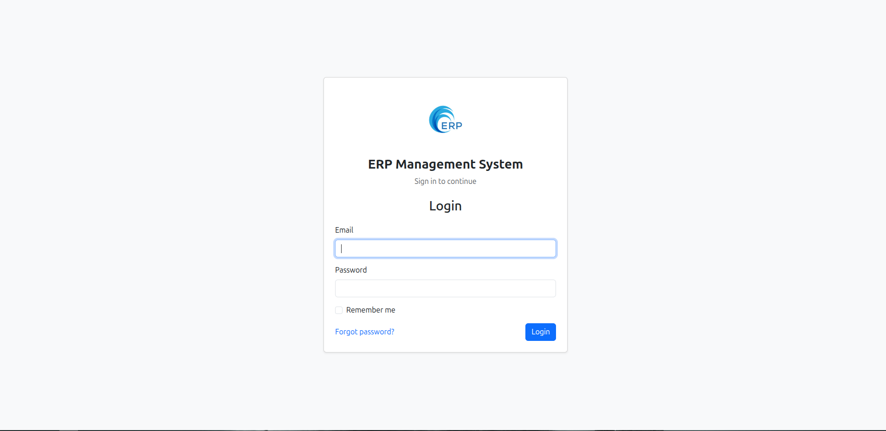

---

## Dashboard

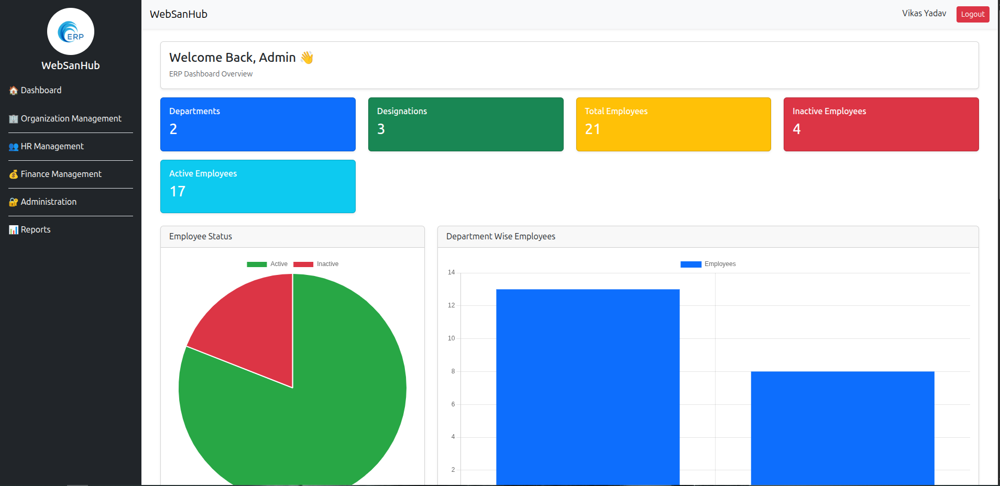

---

## Organization Management

### Departments

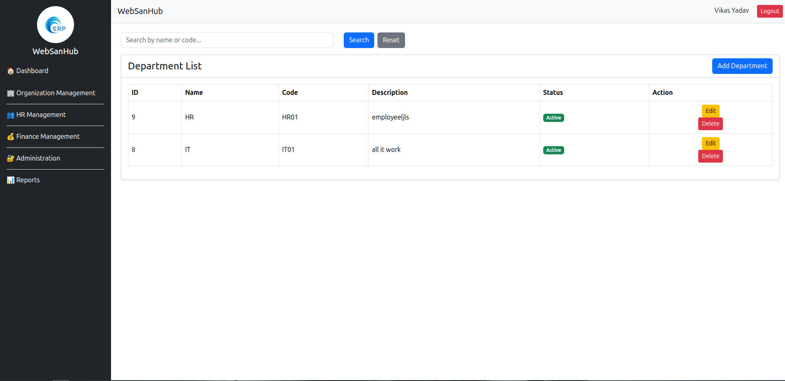

### Designations

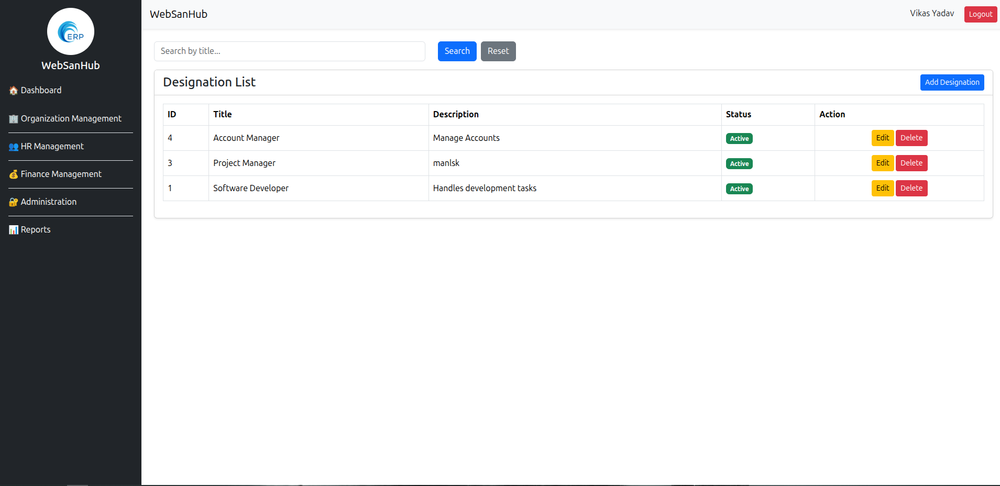

### Employees

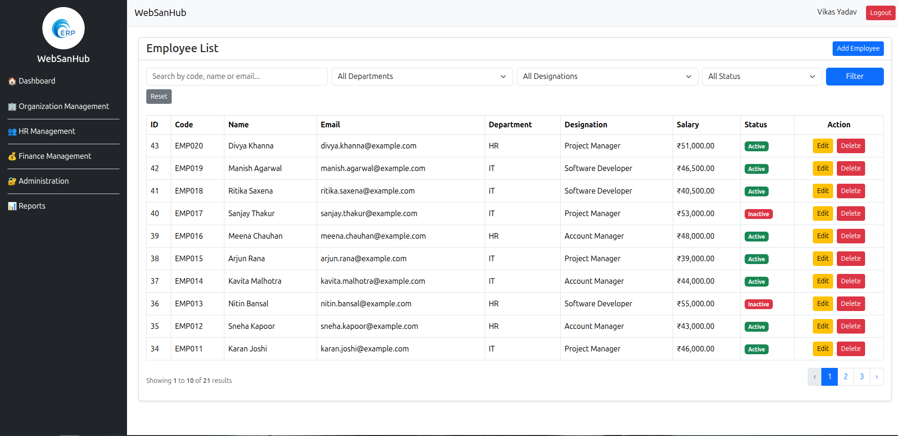

---

## HR Management

### Attendance


### Leave Management

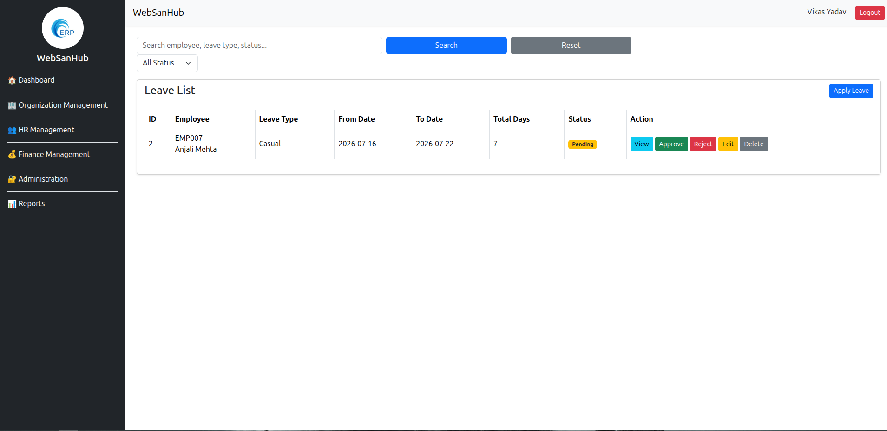

### Holidays

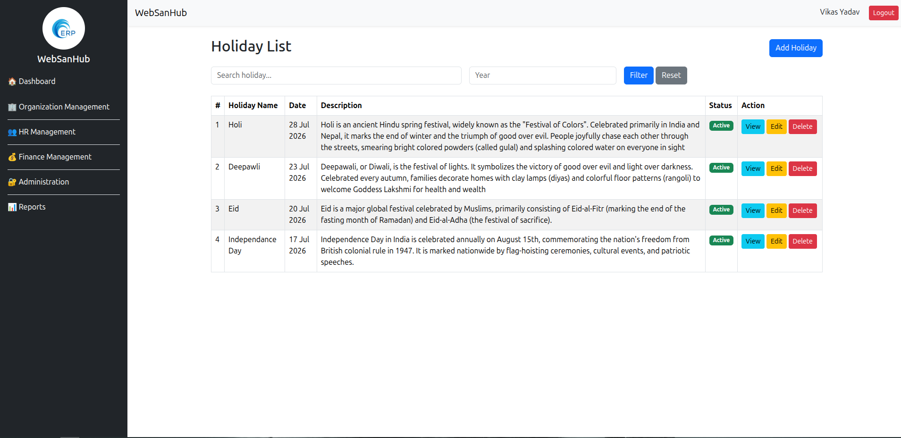

### Employee Documents

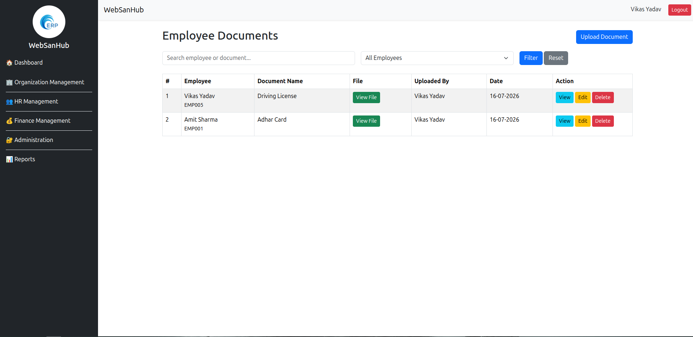

---

## Finance Management

### Payroll


---

## Administration

### Users

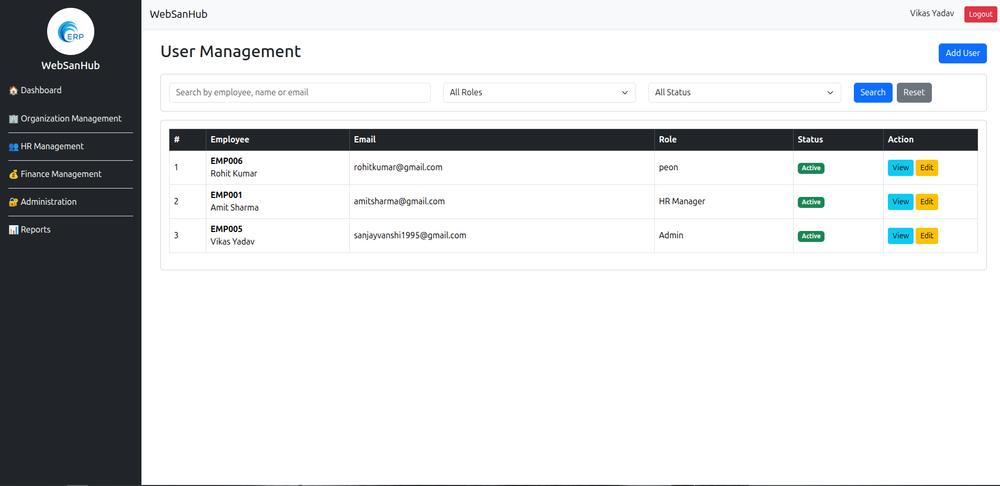

### Roles

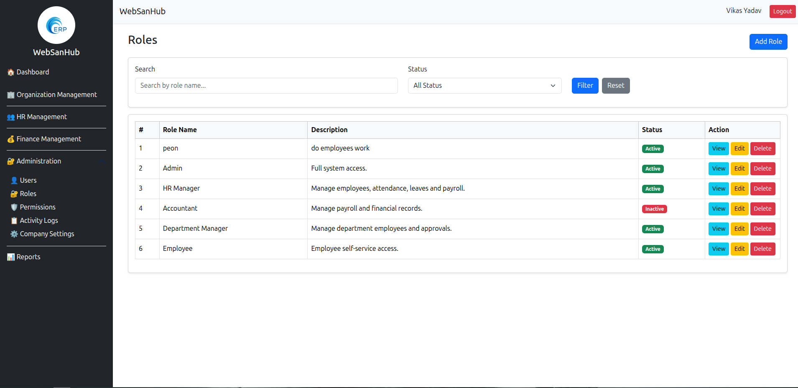

### Permissions

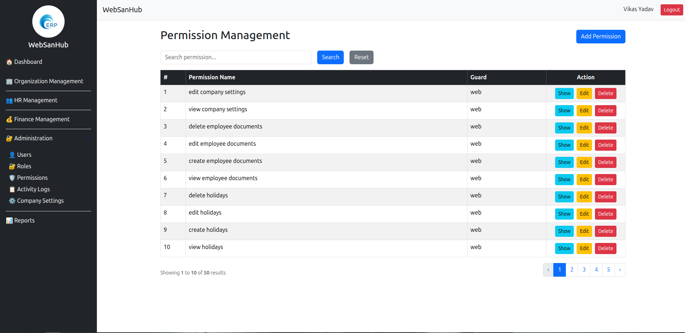

### Activity Logs

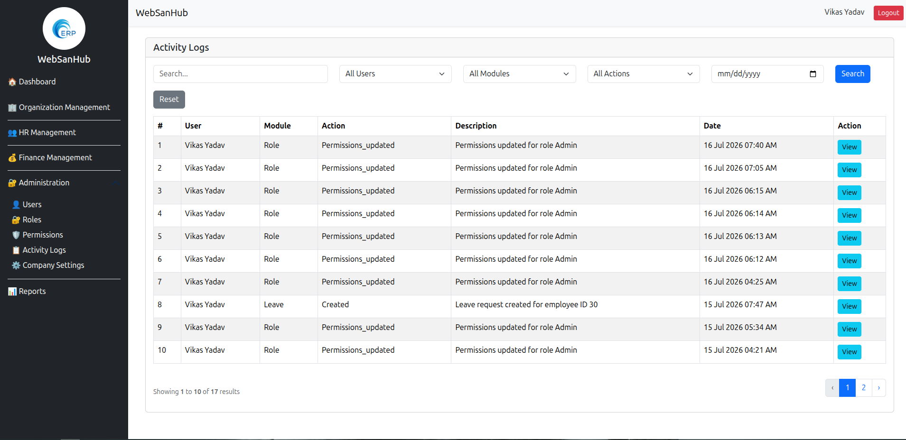

### Company Settings

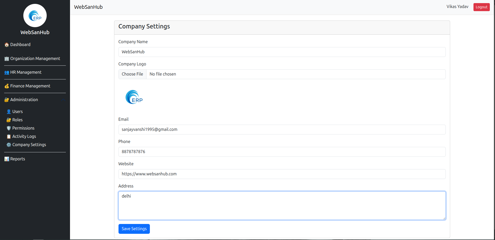

---

## Reports

### Employee Report


### Attendance Report

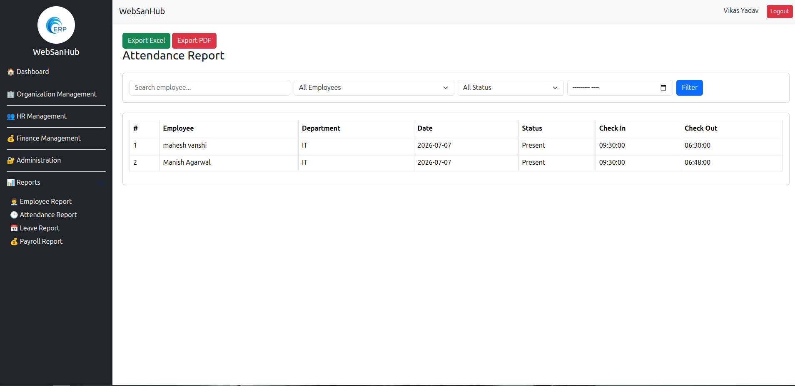

### Leave Report

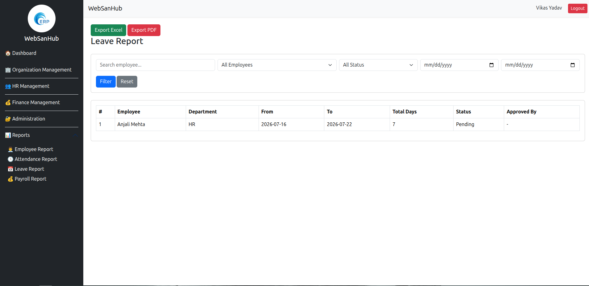

### Payroll Report

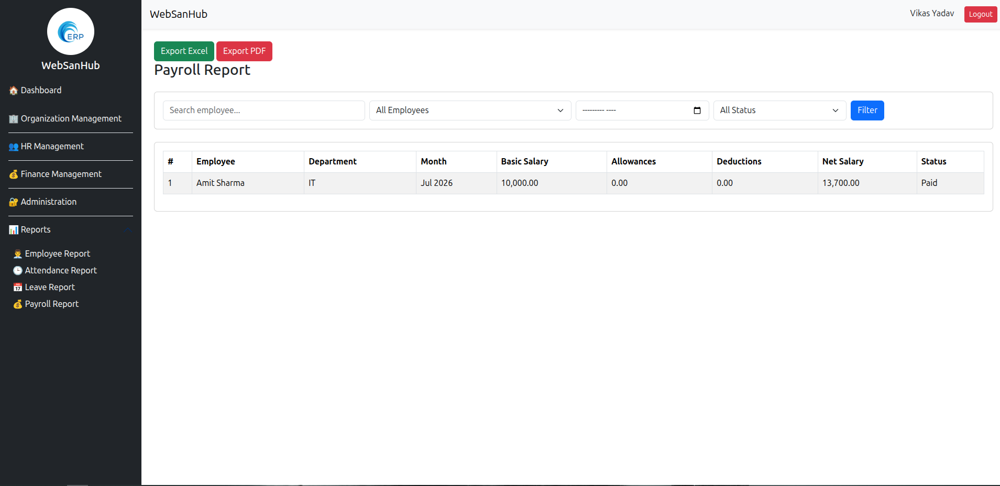

# Installation

## Clone Repository

```bash
git clone https://github.com/sanjay-vanshi/erp_system.git
```
